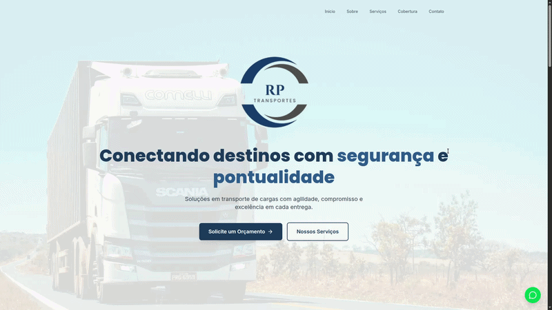

<p align="center">
  
</p>

<h1 align="center">🚚 RP Transportes — Institutional Site</h1>
<p align="center">
  <a href="../README.md">→ Go to README (Portuguese version)</a>
</p>

<p align="center">
  Institutional website developed for <strong>RP Transportes</strong>, focused on presenting services, coverage area, and contact channels in a modern and responsive way.
</p>

<p align="center">
  <a href="https://rptransportes.vercel.app/">🌐 View live site</a>
</p>

> **📌 Public repository for demonstration only**  
> This repository contains a demonstration version of the real project — **RP Transportes institutional site**.  
> To request **full source code access**, please contact:  
> **Email:** [vmoak10@gmail.com](mailto:vmoak10@gmail.com) · **WhatsApp:** [+55 75 99284-1723](https://wa.me/5575992841723)

---

## 📸 Demo

<p align="center">
  
</p>

---

## 📋 About the project

**RP Transportes** is an institutional website created to promote the company's services and coverage area. The page includes sections for introduction, services offered, regions served, and contact form, plus WhatsApp integration for quick support.

**Coming soon:** the site will include a **dashboard** so the client can **customize the site content** (texts, images, contacts, and services) independently, without technical changes.

---

## 🛠 Tech stack

| Category   | Technology |
|------------|------------|
| **Framework** | [React](https://react.dev/) 19 |
| **Build**     | [Vite](https://vite.dev/) 7 |
| **Language**  | [TypeScript](https://www.typescriptlang.org/) |
| **Styling**   | [Tailwind CSS](https://tailwindcss.com/) 4 |
| **Animations** | [Framer Motion](https://www.framer.com/motion/) |
| **Icons**    | [Lucide React](https://lucide.dev/) |
| **Routing**  | [React Router](https://reactrouter.com/) 7 |

---

## 🚀 How to run

```bash
# Clone the repository
git clone <repository-url>
cd rp-transportes-site

# Install dependencies
npm install

# Run in development
npm run dev

# Build for production
npm run build

# Preview the build
npm run preview
```

---

## 📁 Main structure

```
src/
├── components/     # Reusable components (layout, UI, sections)
├── pages/          # Application pages
├── lib/            # Mock data and utilities
├── types/          # TypeScript types
├── App.tsx
└── main.tsx
```

---

## 🔗 Links

- **Live site:** [https://rptransportes.vercel.app/](https://rptransportes.vercel.app/)
- **Client:** RP Transportes

---

<p align="center">
  Developed for <strong>RP Transportes</strong> · 2026
</p>
